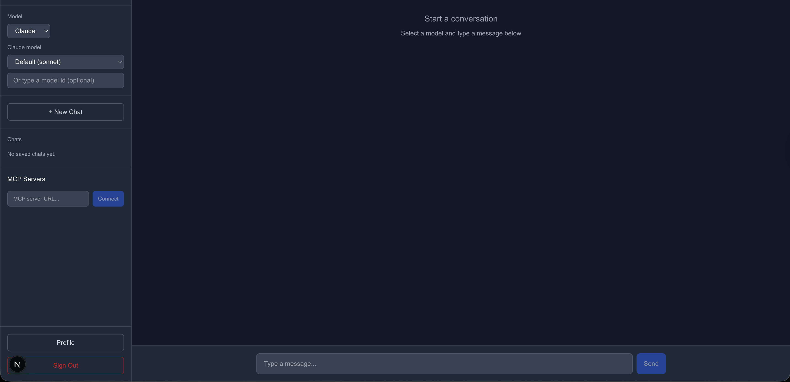

# AI Chat Bot Demo

<!-- Optional: add badges after publishing the repo
[](LICENSE)
[](https://www.python.org/downloads/)
[](https://nodejs.org/)
-->

A chatbot application with pluggable LLM backends (Claude, OpenAI, Ollama), Auth0 authentication, MCP server integration with OAuth, **optional Auth0 FGA / OpenFGA** for order permissions, optional **CIBA** step-up for high-risk actions, and **SQLite** conversation history.

| | |
|--|--|
| **Docs** | [Documentation index](docs/README.md) · [Architecture](docs/ARCHITECTURE.md) · [Development](docs/DEVELOPMENT.md) · [API overview](docs/API-OVERVIEW.md) · [Changelog](CHANGELOG.md) |
| **Images** | [Screenshot placeholders](docs/SCREENSHOTS.md) · add assets under [`docs/images/`](docs/images/) |
| **Contributing** | [CONTRIBUTING.md](CONTRIBUTING.md) · [Security](SECURITY.md) · [Code of conduct](CODE_OF_CONDUCT.md) |
| **License** | [MIT](LICENSE) |

## Preview



## Table of contents

- [Prerequisites](#prerequisites)
- [Auth0 setup](#1-auth0-setup)
- [Configuration](#2-configuration)
- [Starting the application](#3-starting-the-application)
- [Using the app](#4-using-the-app)
- [Auth0 FGA](#5-auth0-fga-fine-grained-authorization)
- [Customization](#6-what-to-change-for-your-setup)
- [Project structure](#project-structure)

## Prerequisites

- **Node.js** 20+
- **Python** 3.11+
- **Auth0 account** (free tier works)
- At least one LLM API key (Anthropic or OpenAI) and/or Ollama installed locally

---

## 1. Auth0 Setup

You need to create two things in your [Auth0 Dashboard](https://manage.auth0.com):

### a) Create an Application

1. Go to **Applications > Applications > Create Application**
2. Choose **Regular Web Application**
3. Note your **Domain**, **Client ID**, and **Client Secret**
4. Under **Settings > Allowed Callback URLs**, add: `http://localhost:3000/auth/callback`
5. Under **Settings > Allowed Logout URLs**, add: `http://localhost:3000`

### b) Create an API

1. Go to **Applications > APIs > Create API**
2. Set the **Identifier** to: `https://api.aichatbot.local` (or any URI you choose)
3. This identifier is your `AUTH0_AUDIENCE`

---

## 2. Configuration

### Backend (`backend/.env`)

Copy the example and fill in your values:

```bash
cp backend/.env.example backend/.env
```

Edit `backend/.env`:

```env
# Auth — must match your Auth0 setup
AUTH_PROVIDER=auth0
AUTH0_DOMAIN=your-tenant.auth0.com        # from Auth0 Application settings
AUTH0_AUDIENCE=https://api.aichatbot.local # the API Identifier you created

# LLM API Keys — fill in whichever you plan to use
ANTHROPIC_API_KEY=sk-ant-...              # from console.anthropic.com
OPENAI_API_KEY=sk-...                     # from platform.openai.com
OLLAMA_BASE_URL=http://localhost:11434    # default Ollama address

# Persistence (conversations)
DATABASE_URL=sqlite:///./app.db

# Optional: Auth0 CIBA (high-value chat orders — see README "Optional: CIBA step-up")
# AUTH0_ISSUER_URL=https://your-tenant.us.auth0.com/
# AUTH0_CIBA_CLIENT_ID=...
# AUTH0_CIBA_CLIENT_SECRET=...
# AUTH0_CIBA_AUDIENCE=https://api.aichatbot.local

# Optional: Auth0 FGA / OpenFGA (see README "Auth0 FGA")
# FGA_API_URL=...
# FGA_STORE_ID=...
# FGA_MODEL_ID=...
# FGA_API_TOKEN=...  (or client credentials — see .env.example)

# App
FRONTEND_URL=http://localhost:3000
```

Full list, including CIBA endpoint overrides and FGA client-credentials: **`backend/.env.example`**.

### Frontend (`frontend/.env.local`)

Copy the example and fill in your values:

```bash
cp frontend/.env.local.example frontend/.env.local
```

Edit `frontend/.env.local`:

```env
# Auth0 — all from your Auth0 Application settings
AUTH0_SECRET=<run: openssl rand -hex 32>   # generate a random secret
AUTH0_BASE_URL=http://localhost:3000
AUTH0_ISSUER_BASE_URL=https://your-tenant.auth0.com
AUTH0_CLIENT_ID=your-client-id
AUTH0_CLIENT_SECRET=your-client-secret
AUTH0_AUDIENCE=https://api.aichatbot.local  # must match backend

# Backend API
NEXT_PUBLIC_API_URL=http://localhost:8000
```

To generate `AUTH0_SECRET`, run:

```bash
openssl rand -hex 32
```

---

## 3. Starting the Application

### Option A: Run locally (two terminals)

**Terminal 1 — Backend:**

```bash
cd backend
python3 -m venv .venv
source .venv/bin/activate
pip install -r requirements.txt
uvicorn app.main:app --reload --port 8000
```

**Terminal 2 — Frontend:**

```bash
cd frontend
npm install
npm run dev
```

Then open [http://localhost:3000](http://localhost:3000).

### Option B: Docker Compose

```bash
# Make sure your .env files are in place first
docker-compose up
```

This starts the backend (port 8000), frontend (port 3000), and an Ollama instance (port 11434).

---

## 4. Using the App

1. Click **Sign In** on the landing page — you'll be redirected to Auth0
2. After login, you land on the **Chat** page
3. Use the **Model** dropdown in the sidebar to pick Claude, OpenAI, or Ollama
4. Type a message and see streaming responses

### Connecting MCP Servers

1. In the sidebar under **MCP Servers**, paste an MCP server URL and click **Connect**
2. If the server requires authentication, a popup opens for you to log in to the server's identity provider
3. Once connected, the server's tools are available to the LLM during chat — tool calls and results appear inline in messages

### Simulated commerce API & agent tools

The backend exposes a fake **products / orders** API under `/api/data/*` and registers tools such as `list_products`, `get_product`, `list_orders`, `get_order`, `create_order`, and `cancel_order`. Seeded **past orders** include **company** and **buyer email** (demo data); new orders use the signed-in user’s email when present, optional **`company`** on `POST /api/data/orders`, or a generated placeholder email if missing. **FGA off:** all orders are listed/visible. **FGA on:** list/get enforce **`can_read`**; create writes **`owner`**; cancel checks **`can_write`**. The `check_permission` tool runs arbitrary FGA checks for demos.

### Conversation history

Chats are stored in SQLite (`DATABASE_URL`). Use **+ New Chat** and the sidebar list to switch threads; each conversation can remember the **provider + model** you used.

---

## 5. Auth0 FGA (Fine-Grained Authorization)

This app can enforce **who may read or cancel which order** using **Auth0 FGA** or any **OpenFGA-compatible** HTTP API.

### Demo mode vs enforced mode

| FGA | List orders (`GET /api/data/orders`) | Get one order | Cancel |
|-----|--------------------------------------|---------------|--------|
| **Off** (env not set) | Returns **all** demo orders (including other users’ seeded history) | Any order id | No FGA check |
| **On** | Only orders where `can_read` is allowed | **403** if not allowed | Requires `can_write` |

Seeded demo orders in memory are **not** written to FGA automatically. With FGA on, those rows only appear if you add matching tuples in FGA (e.g. `owner` for `user:{sub}` and `order:seed-1`) or you rely on orders **created through the app**, which still write an **`owner`** tuple on create.

### What the authorization model must express

- **Types**: `user`, `order`
- **Relations on `order`**:
  - **`owner`**: direct assignment to users (`user:{auth0_sub}`)
  - **`viewer`**: optional read-only assignment (you can add tuples manually for demos)
  - **`can_read`**: `owner` **or** `viewer`
  - **`can_write`**: derived from `owner` (only the owner can cancel)

The backend uses object IDs:

| Concept | OpenFGA object / user string |
|--------|------------------------------|
| End user | `user:{sub}` — `{sub}` is the JWT `sub` (Auth0 user id) |
| Order | `order:{order_uuid}` |

**Tuples written by the app**

- On order create: `user:{sub} owner order:{id}` — after **every** persisted order (`POST /api/data/orders` and the `create_order` tool when the order row is written). **CIBA high-value** chat checkouts defer creating the order until `POST /api/ciba/poll` returns **approved**, so the FGA owner tuple is written only then. See `backend/app/ciba/pending_orders.py` and `backend/app/ciba/router.py`.

**Checks**

- List/get orders / `list_orders` & `get_order` tools: `check(user:{sub}, can_read, order:{id})`
- Cancel order / `cancel_order` tool: `check(user:{sub}, can_write, order:{id})`
- `check_permission` tool: whatever `relation` + `object` the model requests (e.g. `can_read`, `order:seed-1`)

### Sample model (copy & try)

A ready-to-use OpenFGA **schema 1.1** model lives in:

```text
fga/sample-model/
├── authorization-model.fga   # paste into Auth0 FGA / or `fga model write`
└── README.md                 # step-by-step: Auth0 FGA vs OpenFGA CLI
```

1. Copy `fga/sample-model/` or open `authorization-model.fga`.
2. Create a store in **Auth0 FGA** (or OpenFGA) and **publish** that model.
3. Set in `backend/.env`:
   - `FGA_API_URL` — regional FGA API base URL
   - `FGA_STORE_ID`
   - `FGA_MODEL_ID` — id of the published authorization model
   - **Either** `FGA_API_TOKEN` **or** client credentials (`FGA_API_TOKEN_ISSUER`, `FGA_API_AUDIENCE`, `FGA_CLIENT_ID`, `FGA_CLIENT_SECRET`) as documented in `backend/.env.example`
4. Restart the backend. With FGA off (vars unset), order APIs and tools still work without tuple checks.

**If owner tuple writes fail:** check the API/tool response `fga_body` (or `fga_owner_tuple_error`). Common fixes: publish an authorization model where `order` defines `owner` and `can_write` (see `fga/sample-model/`), set **`FGA_MODEL_ID`** to that model, and ensure user ids match `user:{jwt_sub}`. Duplicate tuple writes are treated as success automatically.

### Optional: CIBA step-up

For high-value simulated purchases, the backend can start **Auth0 CIBA** (if you configure `AUTH0_CIBA_*` in `.env`). **No order is stored until the user approves** and the client calls `POST /api/ciba/poll`. The chat UI **polls automatically** after `create_order` returns `approval_required` and **cancels the deferred checkout** if there is no approval within **`approval_timeout_sec`** (default 60s), via `POST /api/ciba/pending/abandon`. See `backend/.env.example` for variables.

- **`AUTH0_ISSUER_URL`** must match your tenant (e.g. `https://dev-xxx.us.auth0.com/`). The backend sends `login_hint` as **JSON** in Auth0’s `iss_sub` form (`format`, `iss`, `sub`); a bare `auth0|…` subject is rejected by Auth0.
- **`AUTH0_CIBA_AUDIENCE`** should be your **API identifier URL only** (same idea as `AUTH0_AUDIENCE`), e.g. `https://api.aichatbot.local`. A value like `AUTH0_AUDIENCE=https://…` (two assignments merged) is invalid.
- **`binding_message`** is restricted by Auth0 to alphanumerics, whitespace, and `+-_.,:#` only. The backend sanitizes messages and avoids characters like `$` or `()` in the default purchase prompt.

---

## 6. What to Change for Your Setup

| What | Where | Notes |
|------|-------|-------|
| Auth0 credentials | `backend/.env` + `frontend/.env.local` | Domain, Client ID, Secret, Audience |
| LLM API keys | `backend/.env` | Only need keys for providers you use |
| Ollama model | Chat sidebar **Ollama model** + `OLLAMA_DEFAULT_MODEL` in `backend/.env` | Auto-picks an installed model if unset |
| Claude / OpenAI model id | Chat sidebar dropdown (or type a custom id) | Falls back to provider defaults in code if empty |
| Default Claude model (code fallback) | `backend/app/llm/anthropic.py` | e.g. `claude-sonnet-4-20250514` |
| Default OpenAI model (code fallback) | `backend/app/llm/openai_provider.py` | e.g. `gpt-4o` |
| CORS origin | `backend/.env` `FRONTEND_URL` | Change if frontend runs on a different port/host |
| Swap to Okta | `backend/.env` set `AUTH_PROVIDER=okta` | Also set `OKTA_ISSUER` and `OKTA_AUDIENCE` |
| FGA model | `fga/sample-model/` | Copy `authorization-model.fga` into your FGA store; set `FGA_*` env vars |
| Conversation DB | `backend/.env` `DATABASE_URL` | Default SQLite file `app.db` under `backend/` |

---

## Project Structure

```
ai_chat_bot/
├── fga/
│   └── sample-model/         # OpenFGA / Auth0 FGA sample authorization model + how to apply it
├── backend/                  # Python FastAPI
│   ├── app/
│   │   ├── main.py           # App entry point, CORS, route registration
│   │   ├── config.py         # Environment variable configuration
│   │   ├── auth/             # JWT validation (Auth0/Okta)
│   │   ├── llm/              # LLM providers + /api/llm/*/models helpers
│   │   ├── chat/             # Chat service + SSE streaming endpoint
│   │   ├── conversations/    # SQLite CRUD for chat history
│   │   ├── data/             # Simulated products/orders API + FGA hooks
│   │   ├── fga/              # OpenFGA / Auth0 FGA HTTP client
│   │   ├── ciba/             # Optional Auth0 CIBA step-up
│   │   ├── mcp_client/       # MCP server connections + OAuth
│   │   └── mcp_routes/       # MCP REST endpoints
│   └── Dockerfile
├── frontend/                 # Next.js 16 (TypeScript, Tailwind)
│   ├── src/
│   │   ├── app/
│   │   │   ├── page.tsx      # Landing page
│   │   │   ├── chat/         # Chat page
│   │   │   ├── profile/      # Authenticated user claims
│   │   │   ├── mcp/callback/ # MCP OAuth callback
│   │   │   └── components/   # UI components
│   │   ├── lib/              # API helpers + React hooks
│   │   └── middleware.ts     # Auth0 middleware
│   └── Dockerfile
├── docker-compose.yml
├── docs/                     # Extra documentation + image placeholders
│   ├── ARCHITECTURE.md
│   ├── DEVELOPMENT.md
│   ├── API-OVERVIEW.md
│   ├── SCREENSHOTS.md
│   └── images/
│       ├── placeholder.svg   # Generic doc image until you add PNGs
│       └── README.md
├── CONTRIBUTING.md
├── SECURITY.md
├── CODE_OF_CONDUCT.md
├── LICENSE
└── .gitignore
```
