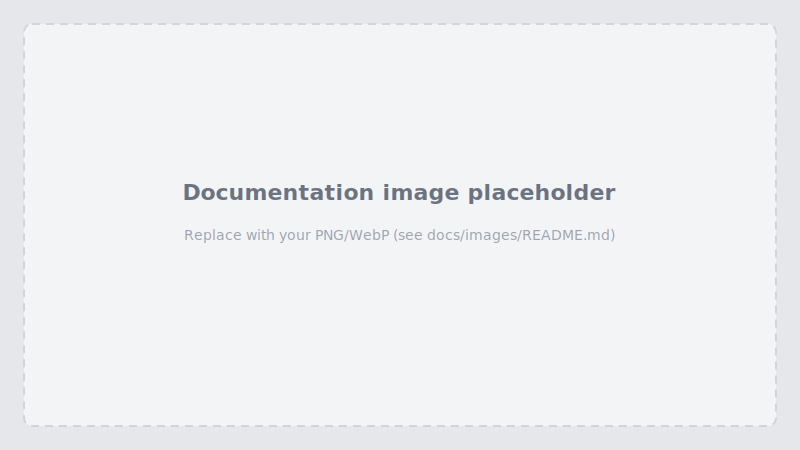

# Screenshot guide

This page lists recommended visuals for the repository and docs. Place image files under [`images/`](images/).

---

## Hero / README banner

Replace the generic placeholder in the root `README.md` with a branded banner if you like.

**Target file:** `docs/images/banner.png` (optional)

---

## Landing & authentication

**Target file:** `docs/images/landing.png`  
**Caption:** Landing page with **Sign in** (Auth0 Universal Login can be a separate shot).

---

## Chat experience

**Target file:** `docs/images/chat.png`  
**Caption:** Main chat view—sidebar with model selector, optional MCP servers, message stream.

---

## Tool use & CIBA

**Target file:** `docs/images/tool-call.png`  
**Caption:** `create_order` (or similar) showing **awaiting CIBA approval** or completed tool result.

---

## Architecture (optional)

**Target file:** `docs/images/architecture.png`  
**Caption:** High-level diagram: Browser → Next.js → FastAPI → LLM / FGA / Auth0 CIBA.

See also [ARCHITECTURE.md](ARCHITECTURE.md) for a text diagram.
